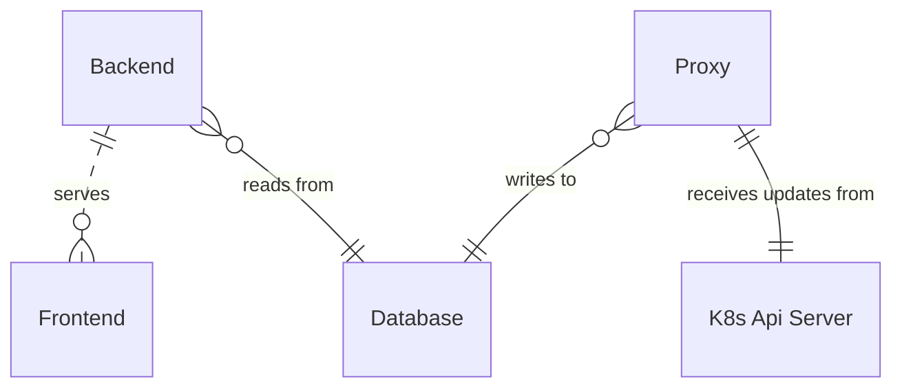

# Planned software architecture

## Runtime Diagram

## Code Components

### Proxy

The Proxy is responsible for reflecting the state of the K8s cluster into the relational DB.
It uses the K8s client libraries to interact with the API server
and [the Bun ORM framework](https://bun.uptrace.dev/) in connection with the [Golang Postgres Driver](https://github.com/lib/pq) to insert data into the DB.

### Web service

The user facing web service consists of a next.js frontend application and a next.js router,
which is responsible for loading the current state from the DB and sending updates to the existing clients.

The frontend is then responsible for displaying the data in a variety of views.

## Tech Stack summary

?? what goes here

## Explanation

The use of a relational DB as the only interface between the proxy and the web service was client requirement, as was the choice of Golang for the backend.

For the frontend we were looking for a modern framework that wasn't burden with too much complexity so we could focus
on the data modeling and the best way to present such complex information.